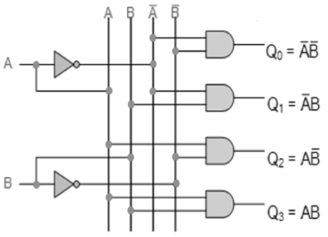
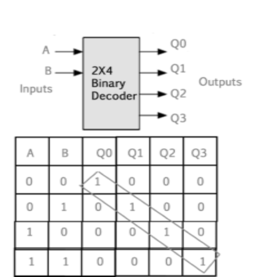

### Introduction

Binary code of N digits can be used to store 2N distinct elements of coded information. This is what encoders and decoders are used for. Encoders convert 2N lines of input into a code of N bits and Decoders decode the N bits into 2N lines. 
 

### 1) 2x4 Decoder / De-multiplexer
The name “Decoder” means to translate or decode coded information from one format into another, so a digital decoder transforms a set of digital input signals into an equivalent decimal code at its output
                         
A decoder is a combinational circuit that converts binary information from n input lines to a maximum of m=2^n unique output lines. 

 
 

<b>Figure 1. Logic Diagram of Decoder</b>
 

#### 1.1) 2-to-4 Binary Decoder 

 

<b>Figure 2. Circuit Diagram of 2-to-4 Decoder</b>
 
The 2-to-4 line binary decoder depicted above consists of an array of four AND gates. The 2 binary inputs labelled A and B are decoded into one of 4 outputs, hence the description of 2-to-4 binary decoder. Each output represents one of the minterms of the 2 input variables, (each output = a minterm). 

 

<b>Figure 3. Logic Diagram and Truth table of 2-to-4 Decoder</b>
 

The binary inputs A and B determine which output line from Q0 to Q3 is “HIGH” at logic level “1” while the remaining outputs are held “LOW” at logic “0” so only one output can be active (HIGH) at any one time.   

Therefore, whichever output line is “HIGH” identifies the binary code present at the input, in other words it “decodes” the binary input.Some binary decoders have an additional input pin labelled “Enable” that controls the outputs from the device.    

This extra input allows the decoders outputs to be turned “ON” or “OFF” as required. Output is only generated when the Enable input has value 1; otherwise, all outputs are 0. Only a small change in the implementation is required: the Enable input is fed into the AND gates which produce the outputs. 

If Enable is 0, all AND gates are supplied with one of the inputs as 0 and hence no output is produced. When Enable is 1, the AND gates get one of the inputs as 1, and now the output depends upon the remaining inputs. Hence the output of the decoder is dependent on whether the Enable is high or low.

### 2) Encoder

An Encoder is a combinational circuit that performs the reverse operation of Decoder.It has maximum of 2n input lines and ‘n’ output lines, hence it encodes the information from 2n inputs into an n-bit code. It will produce a binary code equivalent to the input, which is active High. Therefore, the encoder encodes 2n input lines with ‘n’ bits. 

 
<b>Figure 4. Logic Diagram of ENCODER</b> 

#### 2.1 )4 : 2 Encoder 

The 4 to 2 Encoder consists of four inputs Y3, Y2, Y1 & Y0 and two outputs A1 & A0. At any time, only one of these 4 inputs can be ‘1’ in order to get the respective binary code at the output. 

 

<b>Figure 5. Logic symbol and truth table of 4 to 2 encoder</b> 

